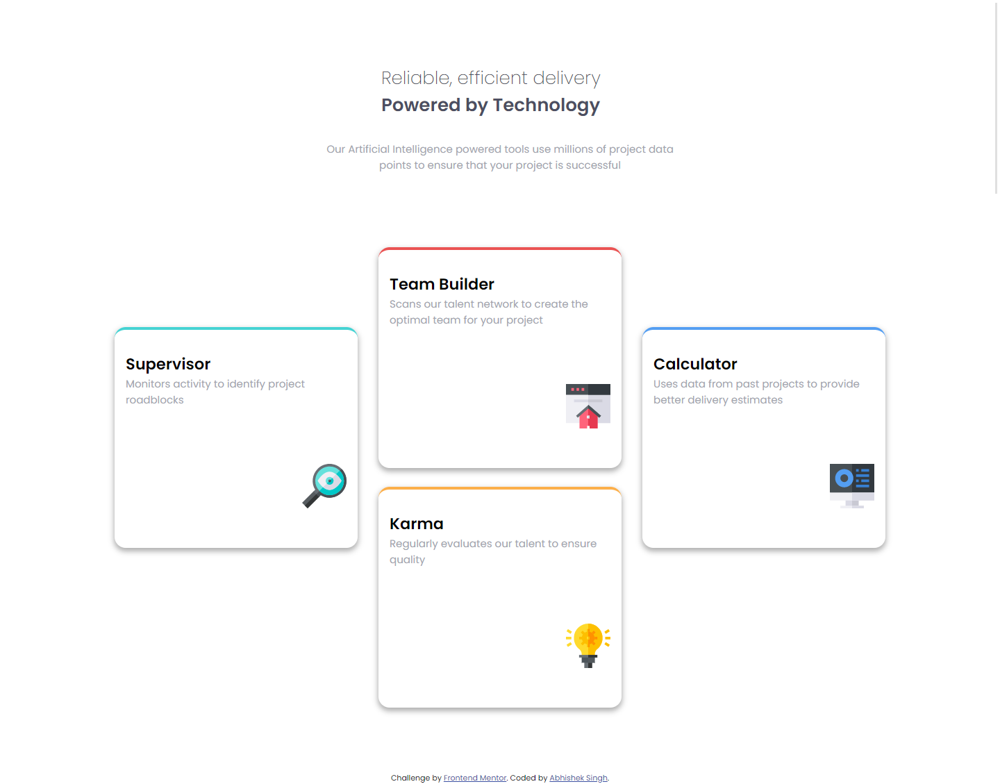
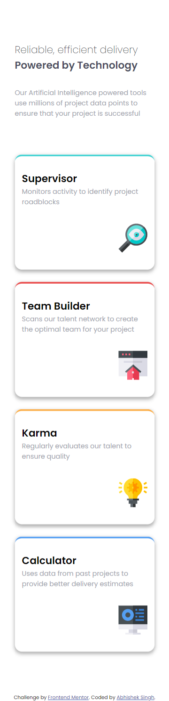

# Frontend Mentor - Four card feature section solution

This is a solution to the [Four card feature section challenge on Frontend Mentor](https://www.frontendmentor.io/challenges/four-card-feature-section-weK1eFYK). Frontend Mentor challenges help you improve your coding skills by building realistic projects. 

## Table of contents

- [Overview](#overview)
  - [The challenge](#the-challenge)
  - [Screenshot](#screenshot)
  - [Links](#links)
- [My process](#my-process)
  - [Built with](#built-with)
  - [What I learned](#what-i-learned)
  - [Continued development](#continued-development)
  - [Useful resources](#useful-resources)
- [Author](#author)

**Note: Delete this note and update the table of contents based on what sections you keep.**

## Overview

### The challenge

Users should be able to:

- View the optimal layout for the site depending on their device's screen size

### Screenshot
- Desktop

- Mobile

### Links

- Solution URL: [Github Repository](https://github.com/abhisheksinghwork7/Four-card-feature-section)
- Live Site URL: [Vercel App](https://four-card-feature-section-tau-swart.vercel.app/)

## My process

### Built with

- Semantic HTML5 markup
- CSS custom properties
- Flexbox
- CSS Grid
- Mobile-first workflow

### What I learned

Css Flex: easy implementation of moving the componenets around from mobile version to desktop version.

BEM model: This naming convention helps standardize html and CSS syntax to increase its readability. 

SASS: Tried my hands on SASS for implementation of css on this project.

### Continued development

Need to standarddizeHTML and CSS implementations in further projects

### Useful resources

- [BEM](http://getbem.com/introduction/) - This helped me to understand BEM model in a better manner and work on the implementation.
- [SASS](https://sass-lang.com/) - This is the site for SASS. I found a lot of usefull articles for implementation of css using SASS

## Author

- Frontend Mentor - [@abhisheksingh7](https://www.frontendmentor.io/profile/abhisheksinghwork7)

